<h2>TensorFlow-FlexUNet-Image-Segmentation-Brain-Tissue (2026/03/11)</h2>
Sarah T.  Arai 
Software Laboratory antillia.com  
This is the first experiment of Image Segmentation for <b>Brain-Tissue</b> based on our <a href="./src/TensorFlowFlexUNet.py">TensorFlowFlexUNet</a> 
(TensorFlow Flexible UNet Image Segmentation Model for Multiclass), 
and a 512x512 pixels PNG 
<a href="https://drive.google.com/file/d/1saFWzH7-W5SFwCRKTg6J3QAWuRfQIg68/view?usp=sharing">
<b>Augmented-Brain-Tissue-ImageMask-Dataset.zip</b></a> which was derived by us from   
<a href="https://www.kaggle.com/datasets/rishukumaroo7/ibsr-brain-tissue-segmentation-dataset/data">
<b>ibsr - brain tissue segmentation dataset</b> </a> on the kaggle.com.
  
<b>Data Augmentation Strategy</b> 
To address the limited size of images and masks of the original <b>brain tissue segmentation dataset</b>, 
we used our offline augmentation tool <a href="./generator/ImageMaskDatasetGenerator.py">ImageMaskDatasetGenerator.py</a> 
 to generate the augmented dataset. Please see also <a href="https://github.com/sarah-antillia/Image-Deformation-Tool">Image-Deformation-Tool</a>. 
   

<b>Actual Image Segmentation for Brain-Tissue Images of  512x512 pixels </b> 
As shown below, the inferred masks predicted by our segmentation model trained by the dataset appear similar to the ground truth masks.
  
<b>rgb_map = {cerebrospinal fluid (CSF):brown, grey matter (GM):green, white matter (WM):yellow}</b>
  
<table>
<tr>
<th>Input: image</th>
<th>Mask (ground_truth)</th>
<th>Prediction: inferred_mask</th>
</tr>
<tr>
<td>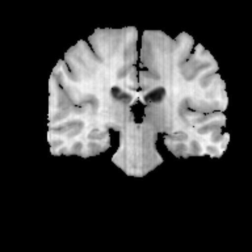</td>
<td>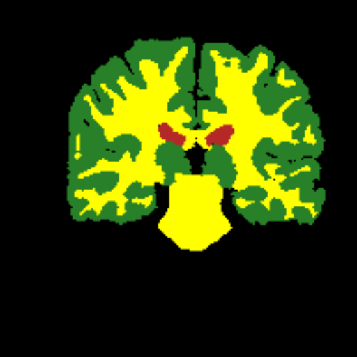</td>
<td>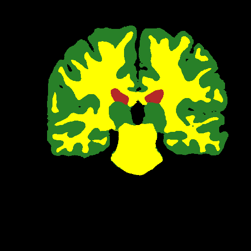</td>
</tr>

<tr>
<td>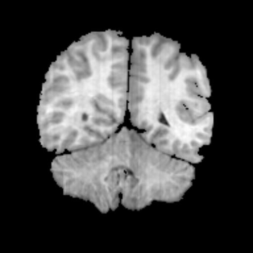</td>
<td>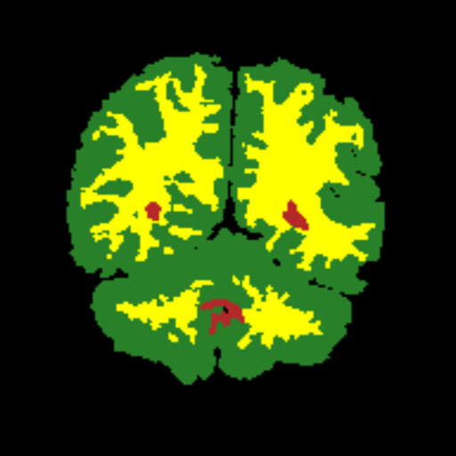</td>
<td></td>
</tr>

<tr>
<td>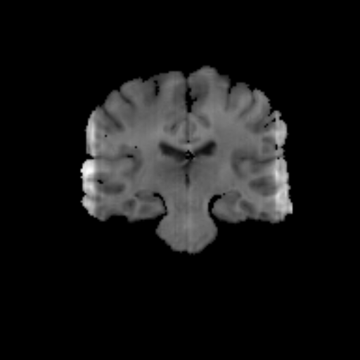</td>
<td>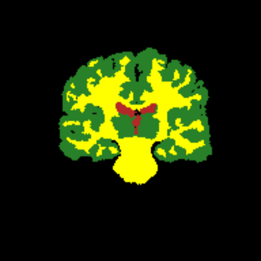</td>
<td>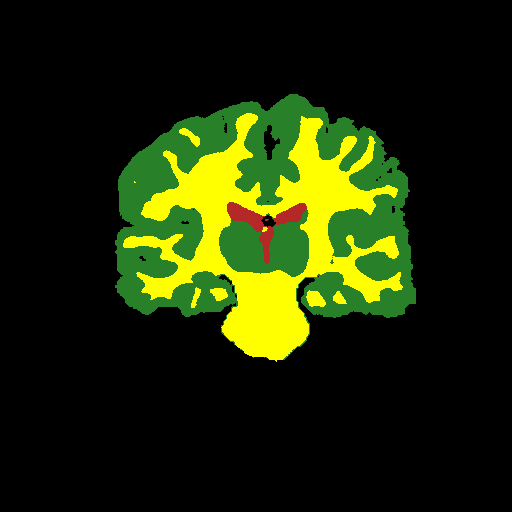</td>
</tr>
</table>

 
<h3>1  Dataset Citation</h3>
The dataset used here was derived from   
<a href="https://www.kaggle.com/datasets/rishukumaroo7/ibsr-brain-tissue-segmentation-dataset/data">
<b>ibsr - brain tissue segmentation dataset</b> </a> 
IBSR: High-Resolution Brain MRI and Segmentation Masks.
  
The following explanation was taken from the zenodo.org web site.
  
The Dataset IBSR consists of mri images (in .npy format) for about 20 patients. 
1. The MRI scans are taken from the axial plane  
2. The scans are 3D images of size 48 x 192 x 192 X 1. (slices, image height, image width, channel)  
    
    
3. The dataset also includes a mask of the brain for each patient in the form of a 3D image of size 48 x 192 x 192 X 4. The mask has 4 segments ( one is background).
     
    
  
4. The dataset is split into training and testing with train set having 16 images and valid set having 4 images. 
  
<b>License</b> 
<a href="https://creativecommons.org/publicdomain/zero/1.0/">CC0: Public Domain</a>
 
 
<h3>
2 Brain-Tissue ImageMask Dataset
</h3>
 If you would like to train this Brain-Tissue Segmentation model by yourself,
please down load our dataset 
 <a href="https://drive.google.com/file/d/1saFWzH7-W5SFwCRKTg6J3QAWuRfQIg68/view?usp=sharing">
<b>Augmented-Brain-Tissue-ImageMask-Dataset.zip</b></a>
 (CC0: Public Domain), expand the downloaded, and put it under <b>./dataset/</b> to be:
<pre>
./dataset
└─Brain-Tissue
    ├─test
    │   ├─images
    │   └─masks
    ├─train
    │   ├─images
    │   └─masks
    └─valid
        ├─images
        └─masks
</pre>
<b>Brain-Tissue Statistics</b> 
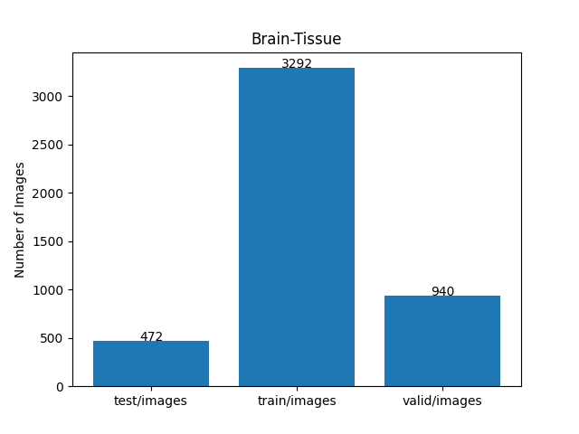 
 
As shown above, the number of images of train and valid datasets is large enough to use for a training set of our segmentation model.
  

<b>Train_images_sample</b> 
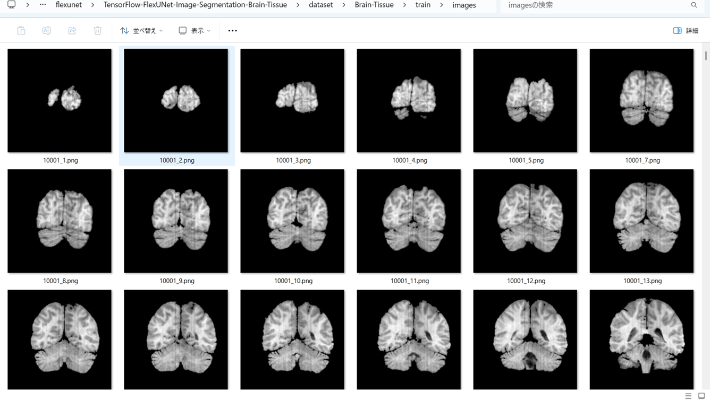
 
<b>Train_masks_sample</b> 
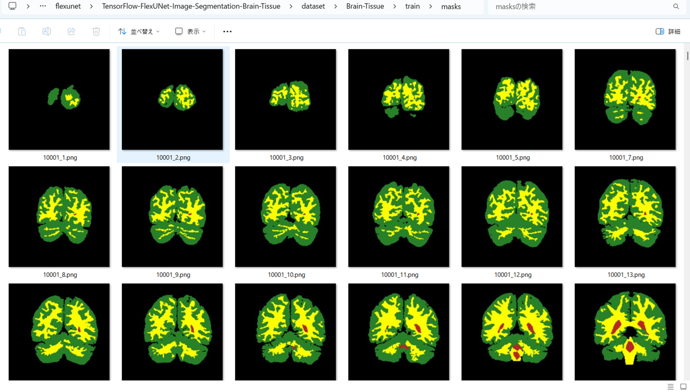
 
<h3>
3 Train TensorflowFlexUNet Model
</h3>
 We trained Brain-Tissue TensorflowFlexUNet Model by using the following
<a href="./projects/TensorFlowFlexUNet/Brain-Tissue/train_eval_infer.config"> <b>train_eval_infer.config</b></a> file.  
Please move to ./projects/TensorFlowFlexUNet/Brain-Tissue, and run the following bat file. 
<pre>
>1.train.bat
</pre>
, which simply runs the following command. 
<pre>
>python ../../../src/TensorFlowFlexUNetTrainer.py ./train_eval_infer.config
</pre>

<b>Model parameters</b> 
Defined a small <b>base_filters=16</b> and a large <b>base_kernels=(11,11)</b> for the first Conv Layer of Encoder Block of 
<a href="./src/TensorFlowFlexUNet.py">TensorFlowFlexUNet.py</a> 
and a large num_layers (including a bridge between Encoder and Decoder Blocks).
<pre>
[model]
image_width    = 512
image_height   = 512
image_channels = 3
input_normalize = True
normalization  = False
num_classes    = 4
base_filters   = 16
base_kernels  = (11,11)
num_layers    = 8
dropout_rate   = 0.05
dilation       = (1,1)
</pre>
<b>Learning rate</b> 
Defined a small learning rate.  
<pre>
[model]
learning_rate  = 0.00007
</pre>
<b>Loss and metrics functions</b> 
Specified "categorical_crossentropy" and "dice_coef_multiclass". 
<pre>
[model]
loss           = "categorical_crossentropy"
metrics        = ["dice_coef_multiclass"]
</pre>
<b >Learning rate reducer callback</b> 
Enabled learing_rate_reducer callback, and a small reducer_patience.
<pre> 
[train]
learning_rate_reducer = True
reducer_factor     = 0.5
reducer_patience   = 4
</pre>
<b>Early stopping callback</b> 
Enabled early stopping callback with patience parameter.
<pre>
[train]
patience      = 10
</pre>
<b></b> 
<b>RGB color map</b> 
rgb color map dict for Brain-Tissue 1+3 classes. 
<pre>
[mask]
mask_file_format = ".png"
;Brain-Tissue 1+3
;     {cerebrospinal fluid (CSF):brown, grey matter (GM):green, white matter (WM):yellow}
rgb_map = {(0,0,0):0,(180,40,40):1,(40,128,40):2,(255,255,0):3 }
</pre>
<b>Epoch change inference callbacks</b> 
Enabled epoch_change_infer callback. 
<pre>
[train]
epoch_change_infer       = True
epoch_change_infer_dir   =  "./epoch_change_infer"
epoch_changeinfer        = False
epoch_changeinfer_dir    = "./epoch_changeinfer"
num_infer_images         = 6
</pre>
By using this epoch_change_infer callback, on every epoch_change, the inference procedure can be called
 for 6 images in <b>mini_test</b> folder. This will help you confirm how the predicted mask changes 
 at each epoch during your training process.    
<b>Epoch_change_inference output at starting (1,2,3)</b> 
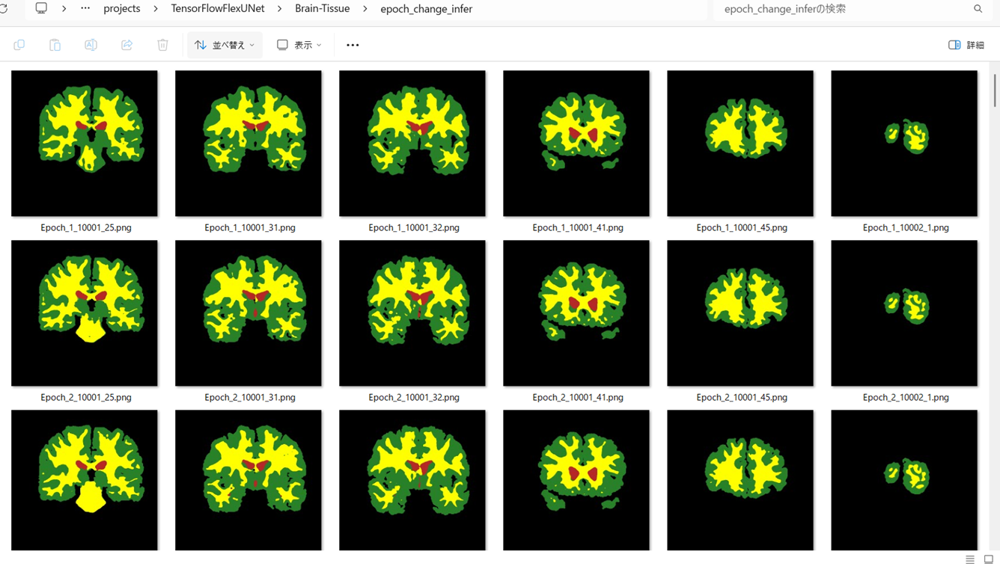 
 
<b>Epoch_change_inference output at middle-point (23,24,25)</b> 
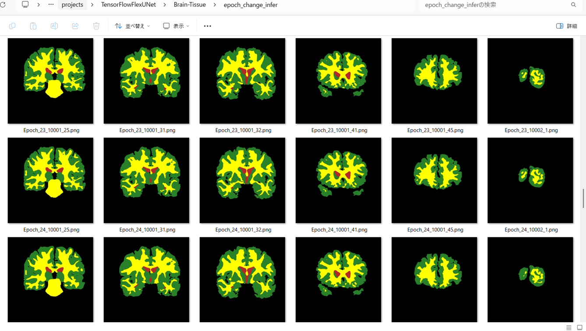 
 
<b>Epoch_change_inference output at ending (48,49,50)</b> 
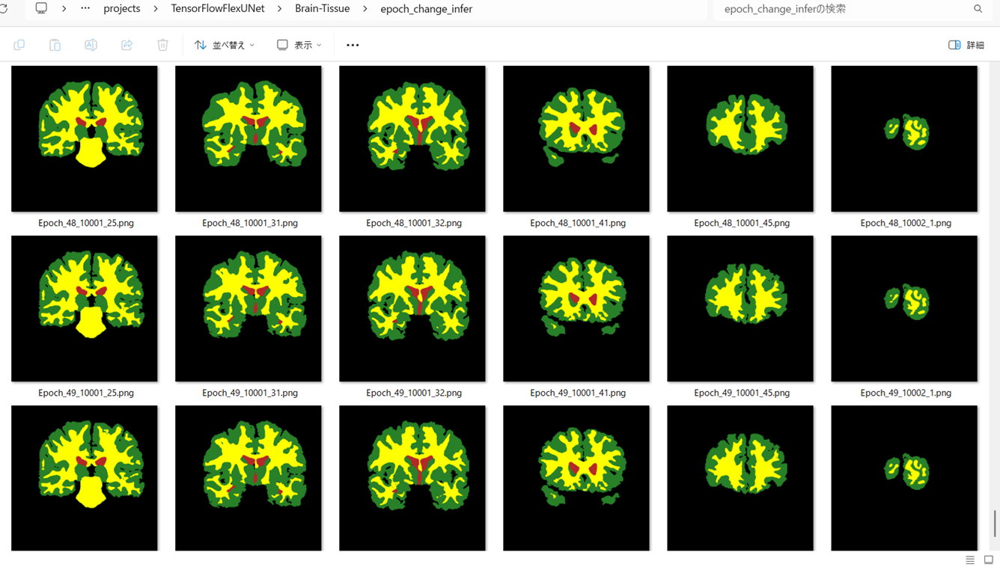 
 
In this experiment, the training process was terminated at epoch 50.  
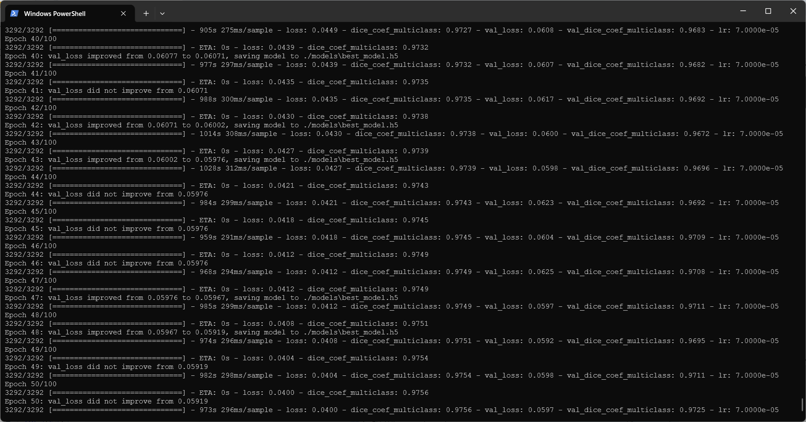 
 
<a href="./projects/TensorFlowFlexUNet/Brain-Tissue/eval/train_metrics.csv">train_metrics.csv</a> 
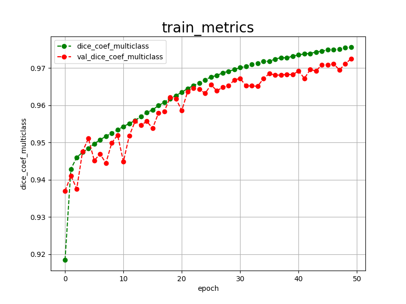 
 
<a href="./projects/TensorFlowFlexUNet/Brain-Tissue/eval/train_losses.csv">train_losses.csv</a> 
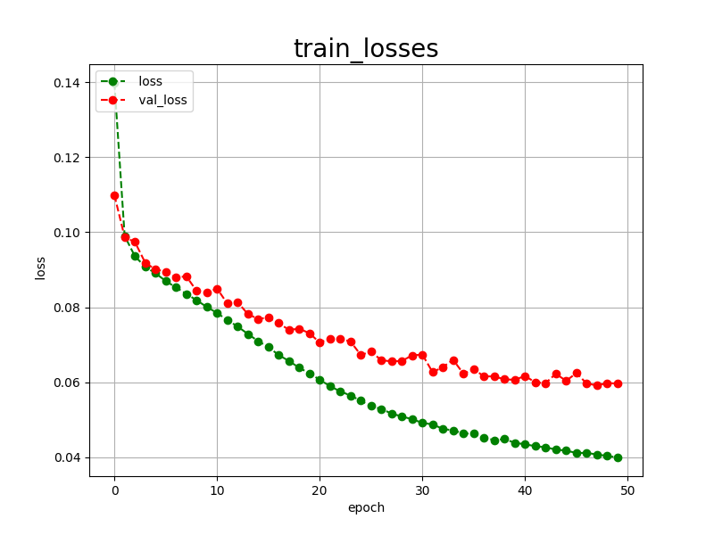 
 
<h3>
4 Evaluation
</h3>
Please move to a <b>./projects/TensorFlowFlexUNet/Brain-Tissue</b> folder, and run the following bat file to evaluate TensorflowFlexUNet model for Brain-Tissue. 
<pre>
>./2.evaluate.bat
</pre>
This bat file simply runs the following command.
<pre>
>python ../../../src/TensorFlowFlexUNetEvaluator.py  ./train_eval_infer.config
</pre>
Evaluation console output: 
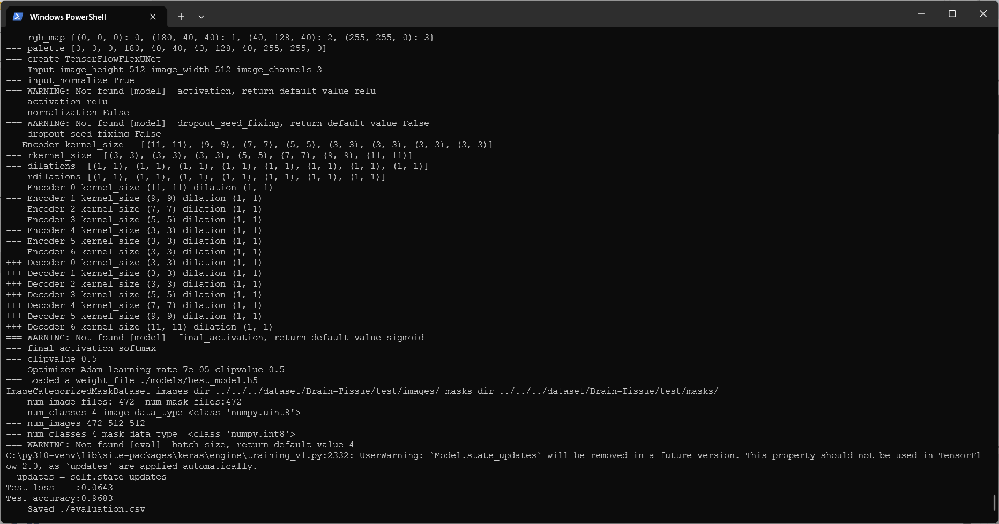
  Image-Segmentation-Brain-Tissue
<a href="./projects/TensorFlowFlexUNet/Brain-Tissue/evaluation.csv">evaluation.csv</a> 
The loss (categorical_crossentropy) to this Brain-Tissue/test was not low, and dice_coef_multiclass not high as shown below.
 
<pre>
categorical_crossentropy,0.0643
dice_coef_multiclass,0.9683
</pre>
 
Please move to a <b>./projects/TensorFlowFlexUNet/Brain-Tissue</b> folder, and run the following bat file to infer segmentation regions for images by the Trained-TensorflowFlexUNet model for Brain-Tissue. 
<pre>
>./3.infer.bat
</pre>
This simply runs the following command.
<pre>
>python ../../../src/TensorFlowFlexUNetInferencer.py ./train_eval_infer.config
</pre>

<b>mini_test_images</b> 
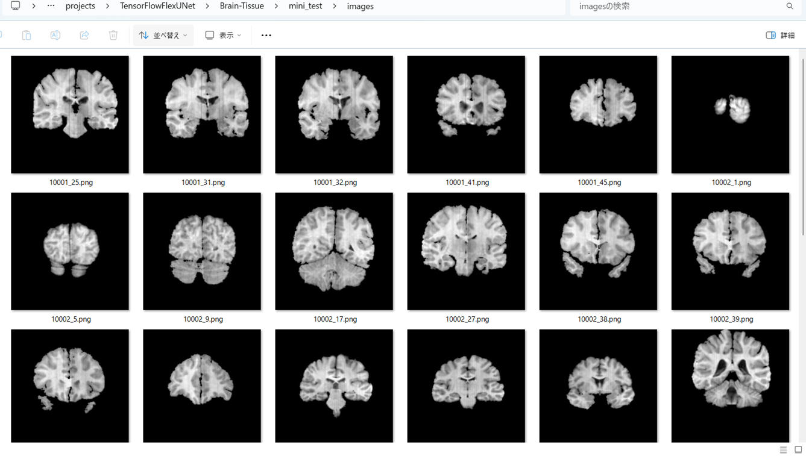 
<b>mini_test_mask(ground_truth)</b> 
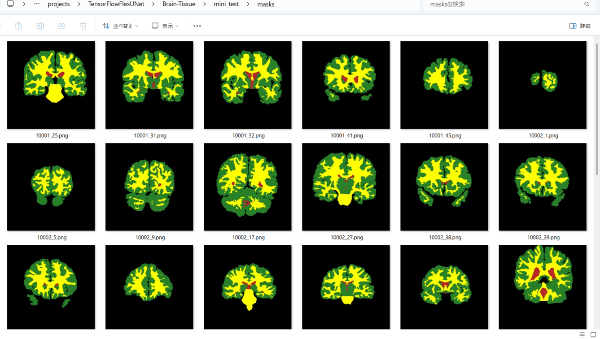 

<b>Inferred test masks</b> 
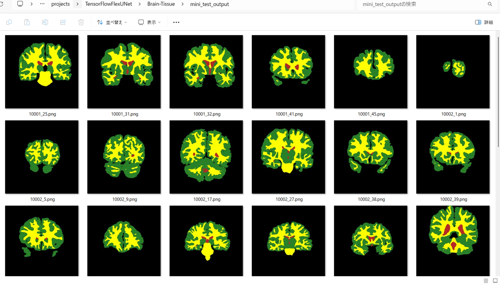 
 

<b>Enlarged images and masks for  Brain-Tissue  Images of 512x512 pixels</b> 
As shown below, the inferred masks predicted by our segmentation model trained by the dataset appear similar to the ground truth masks.
  
<b>rgb_map = {cerebrospinal fluid (CSF):brown, grey matter (GM):green, white matter (WM):yellow}</b>
 
 
<table>
<tr>
<th>Input: image</th>
<th>Mask (ground_truth)</th>
<th>Prediction: inferred_mask</th>
</tr>
<tr>
<td>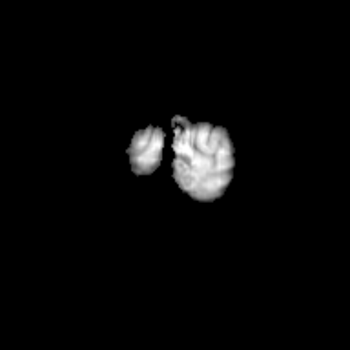</td>
<td>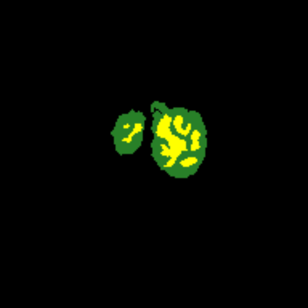</td>
<td>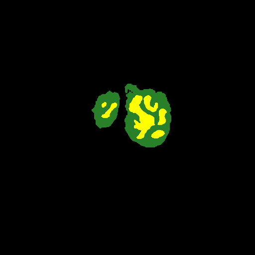</td>
</tr>

<tr>
<td>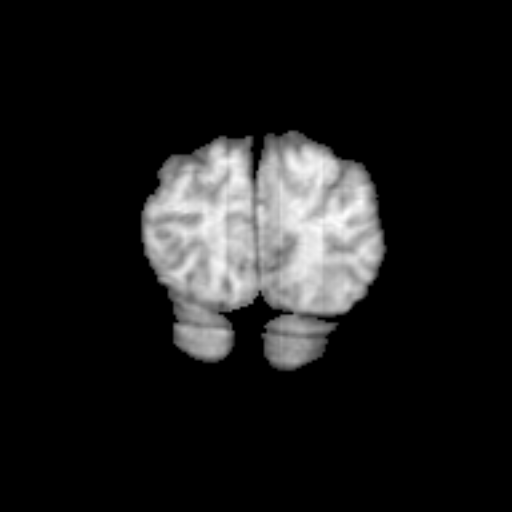</td>
<td>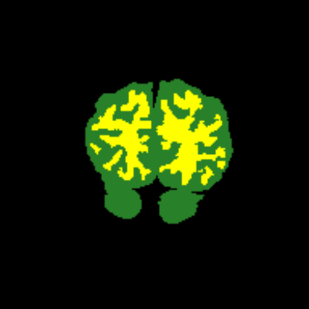</td>
<td>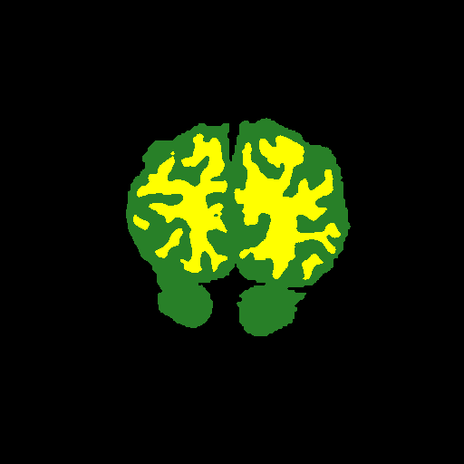</td>
</tr>

<tr>
<td>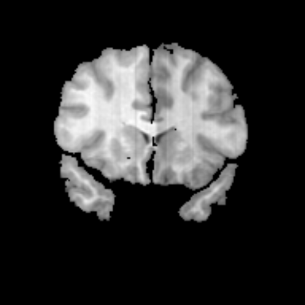</td>
<td>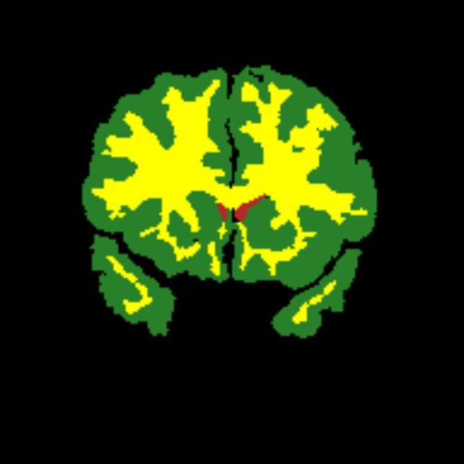</td>
<td>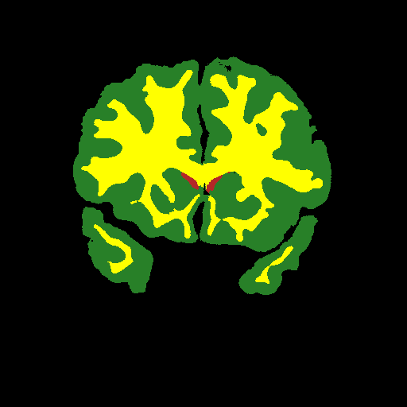</td>
</tr>
<tr>
<td>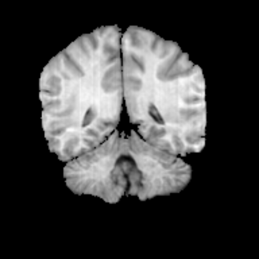</td>
<td>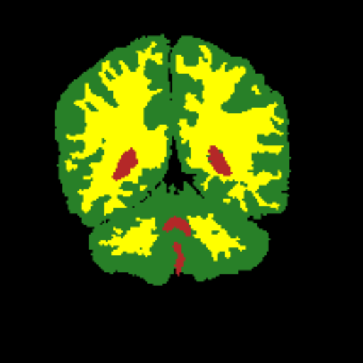</td>
<td>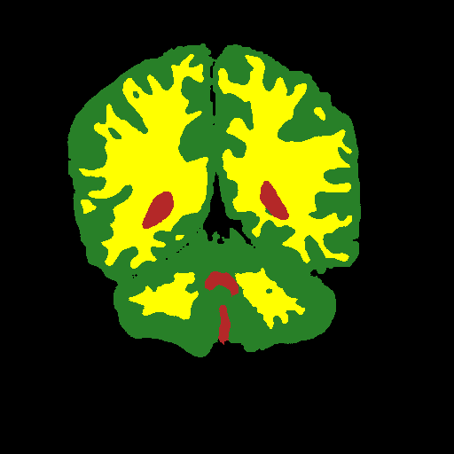</td>
</tr>
<tr>
<td>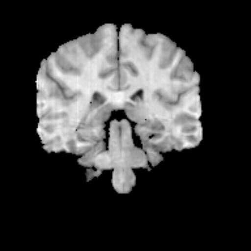</td>
<td>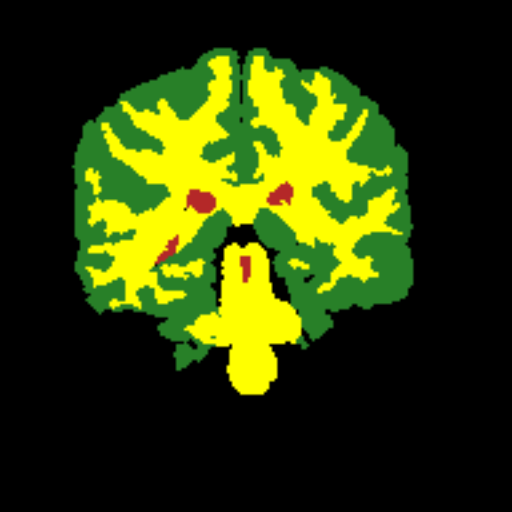</td>
<td>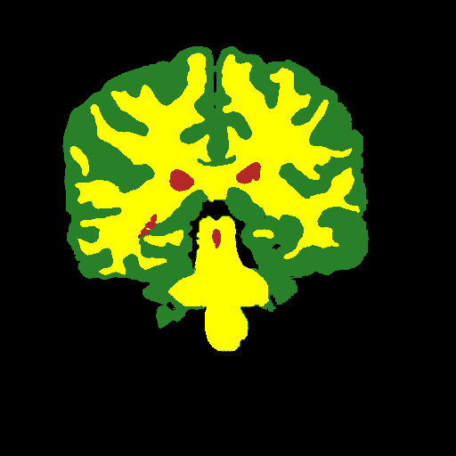</td>
</tr>
<tr>
<td>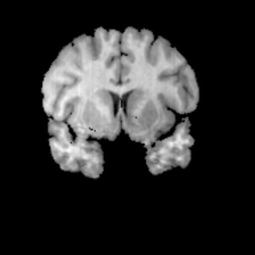</td>
<td>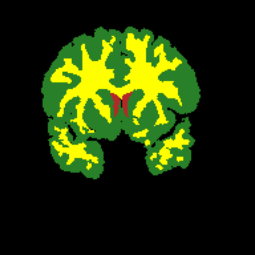</td>
<td>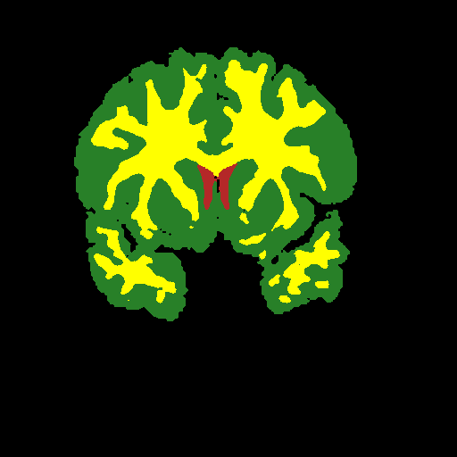</td>
</tr>
</table>

 
<h3>
References
</h3>
<b>1. Automatic brain tissue segmentation based on graph filter</b> 
Youyong Kong, Xiaopeng Chen, Jiasong Wu, Pinzheng Zhang, Yang Chen & Huazhong Shu  
<a href="https://link.springer.com/article/10.1186/s12880-018-0252-x?fromPaywallRec=true">
https://link.springer.com/article/10.1186/s12880-018-0252-x?fromPaywallRec=true
</a>
  
<b>2. IBSR18-brain-tissue-segmentation</b> 
ABDELRAHMAN HABIB 
<a href="https://github.com/abdel-habib/IBSR18-brain-tissue-segmentation">
https://github.com/abdel-habib/IBSR18-brain-tissue-segmentation
</a>
 
 
<b>3. IBSR18-brain-tissue-segmentation</b> 
Mohammad Imran Hossain 
<a href="https://github.com/imran-maia/IBSR_18_BraTSeg_Deep_Learning">
https://github.com/imran-maia/IBSR_18_BraTSeg_Deep_Learning
</a>
 
 
<b>4. TensorFlow-FlexUNet-Image-Segmentation-Model</b> 
Toshiyuki Arai  
<a href="https://github.com/sarah-antillia/TensorFlow-FlexUNet-Image-Segmentation-Model">
https://github.com/sarah-antillia/TensorFlow-FlexUNet-Image-Segmentation-Model
</a>
 
 
